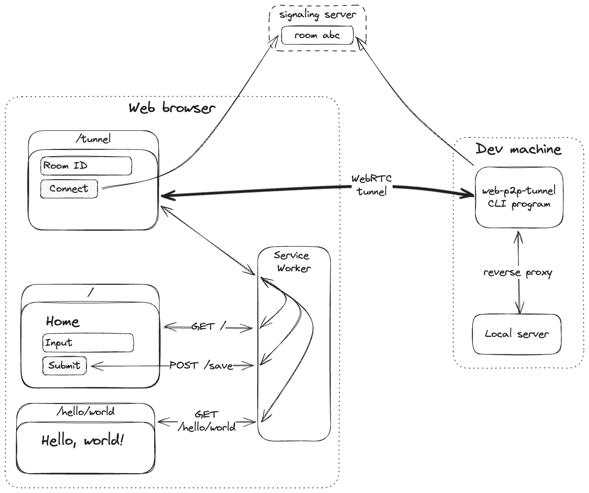

# web-p2p-tunnel

A peer-to-peer HTTP tunnel directly to/from the browser, using WebRTC and a Service Worker. Expose a local web server
directly to any device with a web browser and Internet connection - no server needed.



Consists of:

- **web**: service worker that intercepts requests and web page that tunnels requests over WebRTC data channels.
  Deployed using Github Pages at [tunnel.andrewt.io](https://tunnel.andrewt.io).
- **signaling-server**: server for WebRTC connection bootstrapping via Websockets. Deployed at
  [signal.andrewt.io](https://signal.andrewt.io).
- **web-p2p-tunnel**: CLI program that receives requests, reverse proxies to a local web server, and tunnels responses.

## Installation

The `web-p2p-tunnel` CLI program is the only component you need to install. You will need [Go](https://go.dev/) 1.21+.

```sh
go install github.com/andrewmthomas87/web-p2p-tunnel/cmd/web-p2p-tunnel@latest
```

Ensure the go install directory is in your `PATH` (typically `$HOME/go/bin`).

If you'd like to run the signaling server or host the website yourself, read [Development](#development).

## Usage

Start a local web server. Let's refer to its URL (e.g., `http://localhost:8080`) as `TARGET_URL`.

On the same device, start the `web-p2p-tunnel` CLI program:

```sh
web-p2p-tunnel -signaling-server-url https://signal.andrewt.io -tunnel-target-url $TARGET_URL
```

The program will create and connect to a room using the signaling server. It will log the room's id, like this:

```
Created room fcd549bd-eec1-4e3b-a5ce-f4b182a81f5b
```

Next, on any device, open the tunnel web page at [tunnel.andrewt.io/tunnel](https://tunnel.andrewt.io/tunnel). The
service worker is installed immediately. Enter the room id and click "Connect". The tunnel is active when you have
these statuses:

| Name           | Status    |
| -------------- | --------- |
| Service worker | activated |
| Signaling      | open      |
| WebRTC         | connected |

In a new tab, open the website root [tunnel.andrewt.io](https://tunnel.andrewt.io) or any path not starting with
`/tunnel` (e.g., [tunnel.andrewt.io/hello/world](https://tunnel.andrewt.io/hello/world)).

With the tunnel active, requests matching the origin are intercepted by the service worker and tunneled to the
`web-p2p-tunnel` program, which reverse proxies to your local web server and tunnels the responses back to the service
worker. Requests not matching the origin are not tunneled and execute normally.

### Options

```
web-p2p-tunnel -h

Usage of web-p2p-tunnel:
  -change-host-header
        change the Host header to the host of the target url
  -change-origin-header
        change the Origin header to the origin of the target url
  -signaling-server-url string
        signaling server url (default "http://localhost:8080")
  -tunnel-target-url string
        tunnel target url
```

### Cookies

The browser restricts the ability to manage cookies in the service worker or tunnel web page (see
[Limitations](#limitations)). So, cookies are handled by `web-p2p-tunnel`. The program manages an individual cookie jar
for each tunnel, adding the proper cookies to requests and storing cookies set in responses.

Manipulation of cookies with `document.cookie` is not supported.

### Redirects

Redirect behavior is based on the intercepted request's
[redirect mode](https://fetch.spec.whatwg.org/#concept-request-redirect-mode). I'm working out some kinks here and
there likely are bugs. TODO: document exact behavior.

### Reverse proxy

Go's [`httputil.ReverseProxy`](https://pkg.go.dev/net/http/httputil@go1.21#ReverseProxy) is used. The URL is rewritten
based on the `tunnel-target-url` option (see
[ProxyRequest.SetURL](https://pkg.go.dev/net/http/httputil@go1.21#ProxyRequest.SetURL)). The standard
`X-Forwarded-For`, `X-Forwarded-Host`, and `X-Forwarded-Proto` are set (see
[ProxyRequest.SetXForwarded](https://pkg.go.dev/net/http/httputil@go1.21#ProxyRequest.SetXForwarded)). If the
`change-host-header` is set, the `Host` header is changed to the target url's host. If the `change-origin-header`
option is set, the `Origin` header is changed to the target url's origin.

## Limitations

_Single Host_. Only requests to the website's host are intercepted. Tunneled requests are reverse proxied to a single
target host. Multiple hosts would be a useful feature. There's no limitation from the APIs or architecture for this
feature.

_No Websockets_. This is a limitation of the Service Worker API.

_Different/incorrect HTTP behavior_. When it comes to HTTP requests, the browser does a lot behind the scenes. Some of
this can be replicated, some cannot (e.g.,
[Forbidden headers](https://developer.mozilla.org/en-US/docs/Glossary/Forbidden_header_name)). Some of what can be
replicated is intricate, unknown to me, subtly different between browsers, etc. Expect bugs. Consider opening an issue
:)

_No Service Workers_. That slot is taken.

_Poor browser memory management_: The memory management related to tunneling in the browser is unoptimized. There is
room for improvement, but there are also limitations due to the APIs and architecture.

## Development

### Go

- **signaling-server**: `cmd/signaling-server`
- **web-p2p-tunnel**: `cmd/web-p2p-tunnel`

### Web

From the `web` directory:

Build: `npm run build`

Build (watch mode): `npm run build-watch`

Serve: `npm run serve`
